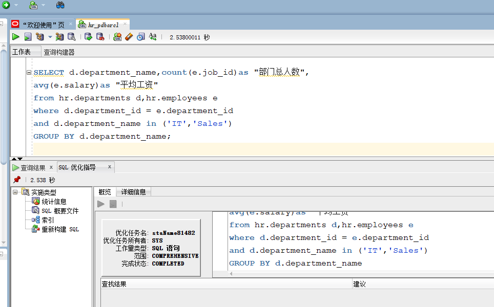
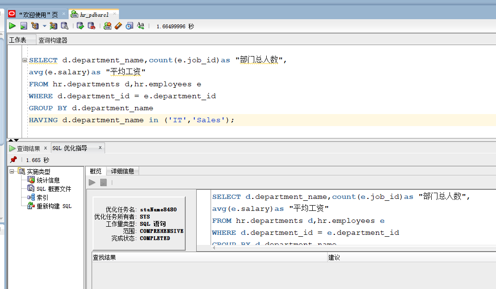
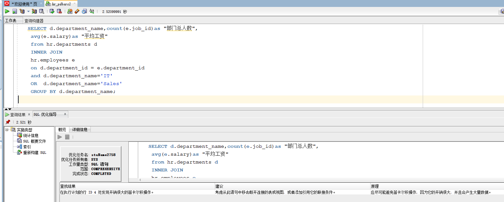

## 201810112302 软工一班邓永霜
# 第一次作业
## 查询一代码
### 
    SELECT d.department_name,count(e.job_id)as "部门总人数",
	avg(e.salary)as "平均工资"
	from hr.departments d,hr.employees e
	where d.department_id = e.department_id
	and d.department_name in ('IT','Sales')
	GROUP BY d.department_name;

## oracle优化指导
查找结果：通过创建一个或多个索引可以改进此语句的执行计划。
建议：考虑运行可以改进物理方案设计的访问指导或者创建推荐的索引。
原理：创建推荐的索引可以显著地改进此语句的执行计划。但是, 使用典型的 SQL 工作量运行 “访问指导” 可能比单个语句更可取。通过这种方法可以 获得全面的索引建议案, 包括计算索引维护的开销和附加的空间消耗。
## 优化设计截图

## 查询二代码
### 
    SELECT d.department_name,count(e.job_id)as "部门总人数",
    avg(e.salary)as "平均工资" 
    FROM hr.departments d,hr.employees e
    WHERE d.department_id = e.department_id
    GROUP BY d.department_name
    HAVING d.department_name in ('IT','Sales');
## 优化设计截图

## oracle优化指导
查找结果：无
建议：无
原理：无
## 自己设计的代码
### 
    SELECT d.department_name,count(e.job_id)as "部门总人数",
	avg(e.salary)as "平均工资"
	from hr.departments d
    INNER JOIN
    hr.employees e
	on d.department_id = e.department_id
	and d.department_name='IT'
    OR  d.department_name='Sales'
	GROUP BY d.department_name;
## oracle优化指导
查找结果：在执行计划的行 ID 3 处发现开销很大的笛卡尔积操作。
建议：考虑从此语句中移去断开连接的表或视图, 或者添加引用它的联接条件。
原理：应尽可能避免笛卡尔积操作, 因为它的开销很大, 并且会产生大量数据。

## 优化设计截图
