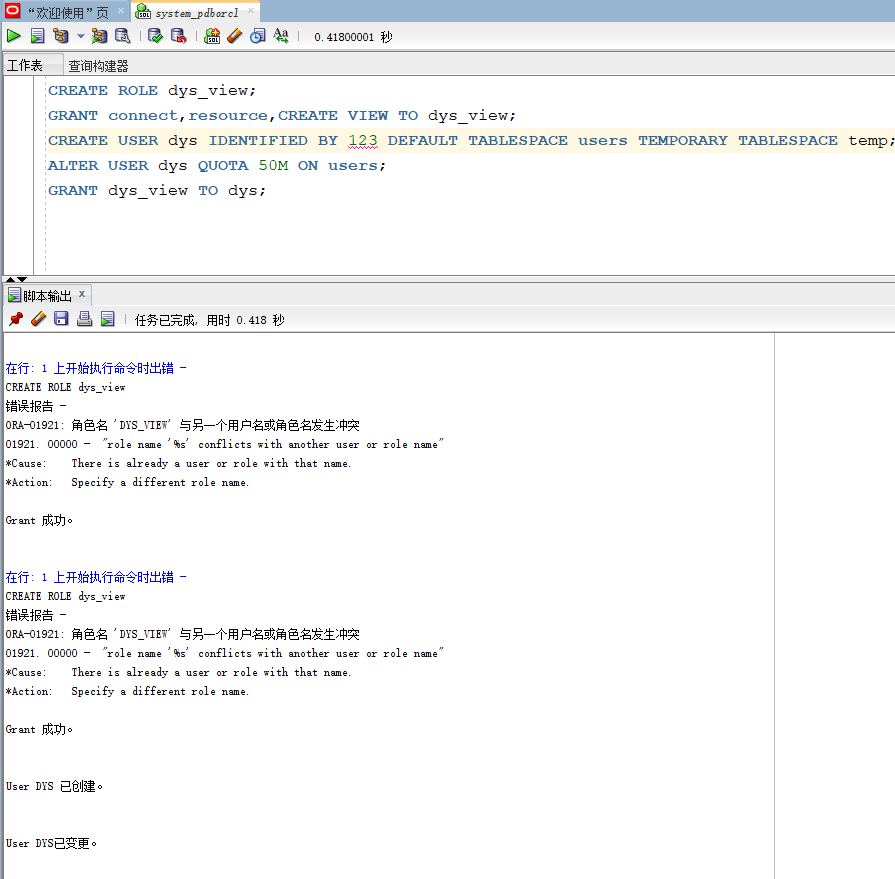
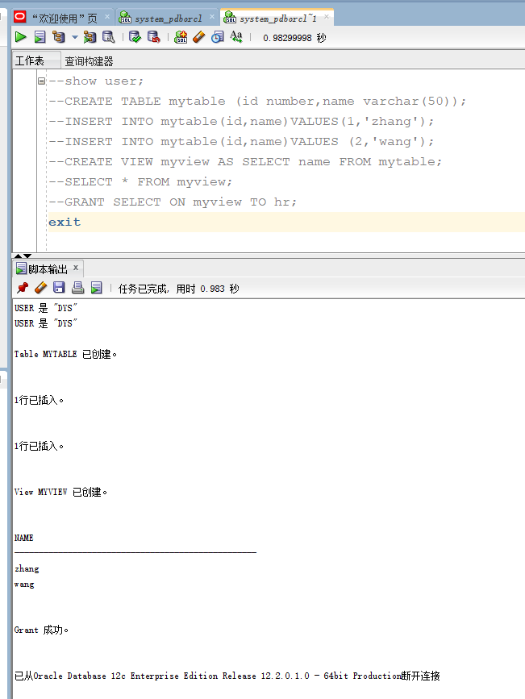
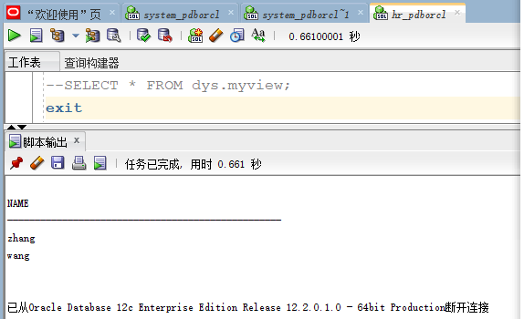
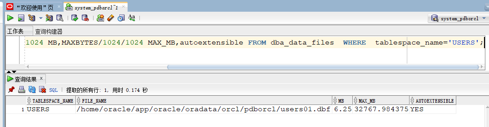
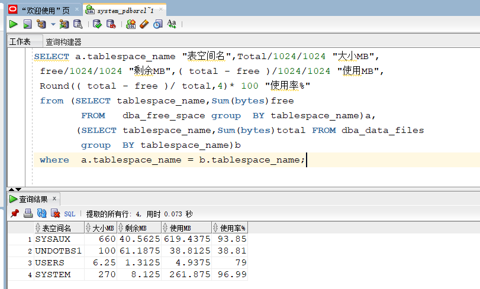

### 201810112302         软工一班   邓永霜
## 实验2：用户及权限管理
### 实验目的 
掌握用户管理、角色管理、权根维护与分配的能力，掌握用户之间共享对象的操作技能。
### 实验内容 
Oracle有一个开发者角色resource，可以创建表、过程、触发器等对象，但是不能创建视图。本训练要求：
1.在pdborcl插接式数据中创建一个新的本地角色con_res_view，该角色包含connect和resource角色，同时也包含CREATE VIEW权限，这样任何拥有con_res_view的用户就同时拥有这三种权限。

2.创建角色之后，再创建用户new_user，给用户分配表空间，设置限额为50M，授予con_res_view角色。

3.最后测试：用新用户new_user连接数据库、创建表，插入数据，创建视图，查询表和视图的数据。
### 实验步骤
#### 以system登录到pdborcl，创建角色dys_view和用户dys，并授权和分配空间：
### 
    CREATE ROLE dys_view;
	GRANT connect,resource,CREATE VIEW TO dys_view;
	CREATE USER dys IDENTIFIED BY 123 DEFAULT TABLESPACE users TEMPORARY TABLESPACE temp;
	ALTER USER dys QUOTA 50M ON users;
	GRANT dys_view TO dys;
	exit;

#### 操作最终截图如下：
语句“ALTER USER dys QUOTA 50M ON users;”是指授权dys用户访问users表空间，空间限额是50M。

#### 新用户dys连接到pdborcl，创建表mytable和视图myview，插入数据，最后将myview的SELECT对象权限授予hr用户。
#### 
    show user;
    CREATE TABLE mytable (id number,name varchar(50));
    INSERT INTO mytable(id,name)VALUES(1,'zhang');
    INSERT INTO mytable(id,name)VALUES (2,'wang');
    CREATE VIEW myview AS SELECT name FROM mytable;
    SELECT * FROM myview;
    GRANT SELECT ON myview TO hr;
    exit
#### 操作最终截图如下：

#### 用户hr连接到pdborcl，查询new_user授予它的视图myview
#### 
    ELECT * FROM dys.myview;

#### 操作最终截图如下：

#### 查看数据库的使用情况
以下样例查看表空间的数据库文件，以及每个文件的磁盘占用情况。
####

    SQL>SELECT tablespace_name,FILE_NAME,BYTES/1024/1024 MB,MAXBYTES/1024/1024 MAX_MB,autoextensible FROM dba_data_files  WHERE  tablespace_name='USERS';

    SQL>SELECT a.tablespace_name "表空间名",Total/1024/1024 "大小MB",free/1024/1024 "剩余MB",( total - free )/1024/1024 "使用MB",Round(( total - free )/ total,4)* 100 "使用率%"from (SELECT tablespace_name,Sum(bytes)free
        FROM   dba_free_space group  BY tablespace_name)a,
       (SELECT tablespace_name,Sum(bytes)total FROM dba_data_files
        group  BY tablespace_name)b
    where  a.tablespace_name = b.tablespace_name;
#### 操作截图如下：

### 实验总结
 通过这次实验，我掌握了角色的创建以及用户创建和角色分配、表空间分配的具体操作语句，同时还对对象创建及共享的设置和权限维护有了一定的掌握，再接再厉啊。