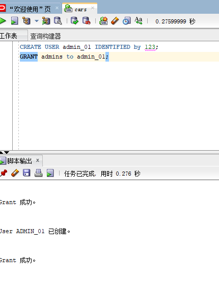
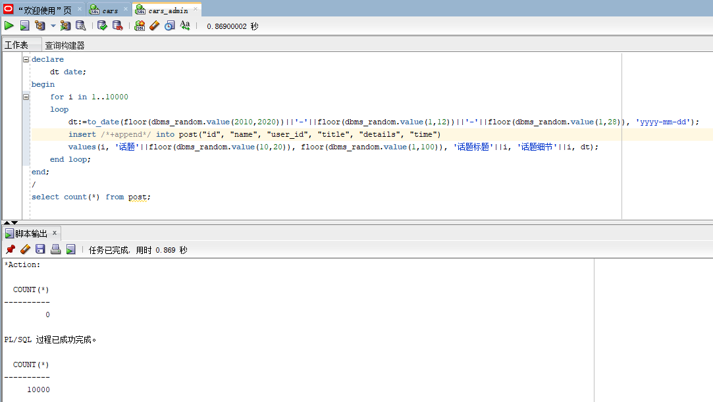
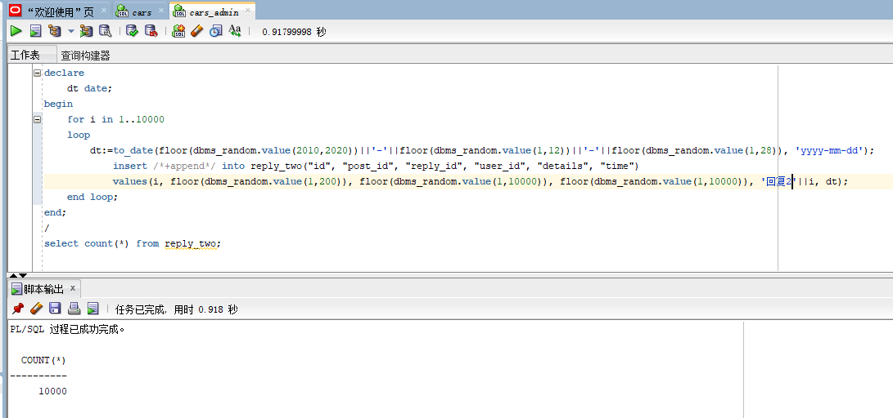
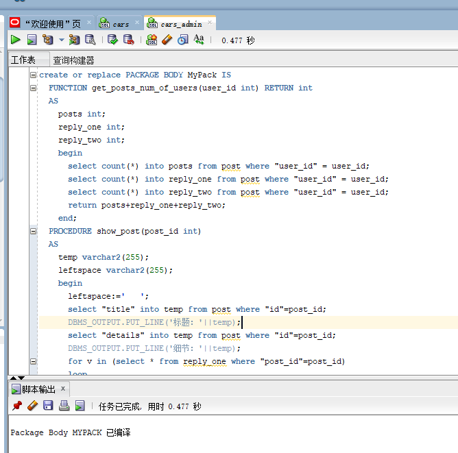

### 201810112302 软工一班 邓永霜
## 实验6：基于Oracle的汽车博客数据库设计
### 一.背景
    伴随经济的飞速发展，国内的汽车保有量不断增加，仅成都一城的汽车保有量就超
    过了一千万。不断增加的汽车用户自然对于一个讨论汽车问题的地方，所以便有了
    各大汽车论坛的诞生，本项目也因此设计了一个基于Oracle 的汽车博客数据库。
### 二．创建表空间
#### 1.创建表空间space01
     CREATE TABLESPACE space01 DATAFILE
     '/home/oracle/app/oracle/oradata/orcl/cars/space01_1.dbf'
     SIZE 100M AUTOEXTEND ON  NEXT 10M MAXSIZE UNLIMITED,
     '/home/oracle/app/oracle/oradata/orcl/cars/space01_2.dbf'
     SIZE 100M AUTOEXTEND ON NEXT 10M MAXSIZE UNLIMITED
     EXTENT MANAGEMENT LOCAL SEGMENT SPACE MANAGEMENT AUTO;

#### 2.创建表空间space02
     CREATE TABLESPACE space01 DATAFILE
     '/home/oracle/app/oracle/oradata/orcl/cars/space02_1.dbf'
     SIZE 100M AUTOEXTEND ON  NEXT 10M MAXSIZE UNLIMITED,
     '/home/oracle/app/oracle/oradata/orcl/cars/space02_2.dbf'
     SIZE 100M AUTOEXTEND ON NEXT 10M MAXSIZE UNLIMITED
     EXTENT MANAGEMENT LOCAL SEGMENT SPACE MANAGEMENT AUTO;

### 三．创建角色
#### 1.创建管理员角色
     CREATE ROLE admins;
     GRANT create any table, alter any table, create tablespace, alter tablespace, create user, alter user,
     create any procedure, alter any procedure, create session, alter session
     to admins with admin option;、

#### 2.创建用户角色
     CREATE ROLE users;
     GRANT create session to users with admin option;

### 四．创建用户
#### 1.创建管理员用户
##### 创建管理员用户admin_01,并赋予它所有权限
      GRANT "DBA" TO "admin_01" WITH admin_01 OPTION;  
      GRANT "C##CON_RES" TO "admin_01" WITH admin_01 OPTION;  
      GRANT "DV_MONITOR" TO "admin_01" WITH admin_01 OPTION;  
      GRANT "CTXAPP" TO "admin_01" WITH admin_01 OPTION;  
      GRANT "DV_AUDIT_CLEANUP" TO "admin_01" WITH admin_01 OPTION;  
      GRANT "SPATIAL_CSW_admin_01" TO "admin_01" WITH admin_01 OPTION;  
      GRANT "APEX_GRANTS_FOR_NEW_USERS_ROLE" TO "admin_01" WITH admin_01 OPTION;  
      GRANT "WFS_USR_ROLE" TO "admin_01" WITH admin_01 OPTION;  
      GRANT "EM_EXPRESS_ALL" TO "admin_01" WITH admin_01 OPTION;  
      GRANT "WM_admin_01_ROLE" TO "admin_01" WITH admin_01 OPTION;  
      GRANT "OLAP_USER" TO "admin_01" WITH admin_01 OPTION;  
      GRANT "OLAP_XS_admin_01" TO "admin_01" WITH admin_01 OPTION;  
      GRANT "DV_SECANALYST" TO "admin_01" WITH admin_01 OPTION;  
      GRANT "CSW_USR_ROLE" TO "admin_01" WITH admin_01 OPTION;  
      GRANT "XS_CACHE_admin_01" TO "admin_01" WITH admin_01 OPTION;  
      GRANT "GDS_CATALOG_SELECT" TO "admin_01" WITH admin_01 OPTION;  
      GRANT "SCHEDULER_admin_01" TO "admin_01" WITH admin_01 OPTION;  
      GRANT "PROVISIONER" TO "admin_01" WITH admin_01 OPTION;  
      GRANT "AUDIT_admin_01" TO "admin_01" WITH admin_01 OPTION;  
      GRANT "XDB_WEBSERVICES_OVER_HTTP" TO "admin_01" WITH admin_01 OPTION;  
      GRANT "DV_REALM_RESOURCE" TO "admin_01" WITH admin_01 OPTION;  
      GRANT "AQ_admin_01ISTRATOR_ROLE" TO "admin_01" WITH admin_01 OPTION;  
      GRANT "DELETE_CATALOG_ROLE" TO "admin_01" WITH admin_01 OPTION;  
      GRANT "CON_RES" TO "admin_01" WITH admin_01 OPTION;  
      GRANT "XDB_WEBSERVICES" TO "admin_01" WITH admin_01 OPTION;  
      GRANT "DV_PUBLIC" TO "admin_01" WITH admin_01 OPTION;  
      GRANT "LBAC_DBA" TO "admin_01" WITH admin_01 OPTION;  
      GRANT "OPTIMIZER_PROCESSING_RATE" TO "admin_01" WITH admin_01 OPTION;  
      GRANT "RECOVERY_CATALOG_USER" TO "admin_01" WITH admin_01 OPTION;  
      GRANT "DV_DATAPUMP_NETWORK_LINK" TO "admin_01" WITH admin_01 OPTION;  
      GRANT "GSMUSER_ROLE" TO "admin_01" WITH admin_01 OPTION;  
      GRANT "GATHER_SYSTEM_STATISTICS" TO "admin_01" WITH admin_01 OPTION;  
      GRANT "LOGSTDBY_admin_01ISTRATOR" TO "admin_01" WITH admin_01 OPTION;  
      GRANT "GSM_POOLadmin_01_ROLE" TO "admin_01" WITH admin_01 OPTION;  
      GRANT "DV_admin_01" TO "admin_01" WITH admin_01 OPTION;  
      GRANT "HS_admin_01_ROLE" TO "admin_01" WITH admin_01 OPTION;  
      GRANT "XS_SESSION_admin_01" TO "admin_01" WITH admin_01 OPTION;  
      GRANT "DV_GOLDENGATE_admin_01" TO "admin_01" WITH admin_01 OPTION;  
      GRANT "IMP_FULL_DATABASE" TO "admin_01" WITH admin_01 OPTION;  
      GRANT "DV_XSTREAM_admin_01" TO "admin_01" WITH admin_01 OPTION;  
      GRANT "DV_PATCH_admin_01" TO "admin_01" WITH admin_01 OPTION;  
      GRANT "DATAPUMP_EXP_FULL_DATABASE" TO "admin_01" WITH admin_01 OPTION;  
      GRANT "EJBCLIENT" TO "admin_01" WITH admin_01 OPTION;  
      GRANT "HS_admin_01_EXECUTE_ROLE" TO "admin_01" WITH admin_01 OPTION;  
      GRANT "JMXSERVER" TO "admin_01" WITH admin_01 OPTION;  
      GRANT "OLAP_DBA" TO "admin_01" WITH admin_01 OPTION;  
      GRANT "ADM_PARALLEL_EXECUTE_TASK" TO "admin_01" WITH admin_01 OPTION;  
      GRANT "JAVAIDPRIV" TO "admin_01" WITH admin_01 OPTION;  
      GRANT "SELECT_CATALOG_ROLE" TO "admin_01" WITH admin_01 OPTION;  
      GRANT "JAVADEBUGPRIV" TO "admin_01" WITH admin_01 OPTION;  
      GRANT "CONNECT" TO "admin_01" WITH admin_01 OPTION;  
      GRANT "DATAPUMP_IMP_FULL_DATABASE" TO "admin_01" WITH admin_01 OPTION;  
      GRANT "OEM_MONITOR" TO "admin_01" WITH admin_01 OPTION;  
      GRANT "APEX_admin_01ISTRATOR_ROLE" TO "admin_01" WITH admin_01 OPTION;  
      GRANT "GSMadmin_01_ROLE" TO "admin_01" WITH admin_01 OPTION;  
      GRANT "AQ_USER_ROLE" TO "admin_01" WITH admin_01 OPTION;  
      GRANT "JAVAUSERPRIV" TO "admin_01" WITH admin_01 OPTION;  
      GRANT "XDB_SET_INVOKER" TO "admin_01" WITH admin_01 OPTION;  
      GRANT "RECOVERY_CATALOG_OWNER" TO "admin_01" WITH admin_01 OPTION;  
      GRANT "JAVA_admin_01" TO "admin_01" WITH admin_01 OPTION;  
      GRANT "DBFS_ROLE" TO "admin_01" WITH admin_01 OPTION;  
      GRANT "PDB_DBA" TO "admin_01" WITH admin_01 OPTION;  
      GRANT "DV_GOLDENGATE_REDO_ACCESS" TO "admin_01" WITH admin_01 OPTION;  
      GRANT "CDB_DBA" TO "admin_01" WITH admin_01 OPTION;  
      GRANT "JAVASYSPRIV" TO "admin_01" WITH admin_01 OPTION;  
      GRANT "HS_admin_01_SELECT_ROLE" TO "admin_01" WITH admin_01 OPTION;  
      GRANT "AUDIT_VIEWER" TO "admin_01" WITH admin_01 OPTION;  
      GRANT "RESOURCE" TO "admin_01" WITH admin_01 OPTION;  
      GRANT "DV_OWNER" TO "admin_01" WITH admin_01 OPTION;  
      GRANT "XDB_WEBSERVICES_WITH_PUBLIC" TO "admin_01" WITH admin_01 OPTION; 
      GRANT "EXECUTE_CATALOG_ROLE" TO "admin_01" WITH admin_01 OPTION;  
      GRANT "DV_ACCTMGR" TO "admin_01" WITH admin_01 OPTION;  
      GRANT "DV_REALM_OWNER" TO "admin_01" WITH admin_01 OPTION;  
      GRANT "EXP_FULL_DATABASE" TO "admin_01" WITH admin_01 OPTION;  
      GRANT "DV_STREAMS_admin_01" TO "admin_01" WITH admin_01 OPTION;  
      GRANT "JAVA_DEPLOY" TO "admin_01" WITH admin_01 OPTION;  
      GRANT "SPATIAL_WFS_admin_01" TO "admin_01" WITH admin_01 OPTION;  
      GRANT "XS_NAMESPACE_admin_01" TO "admin_01" WITH admin_01 OPTION;  
      GRANT "DEV" TO "admin_01" WITH admin_01 OPTION;  
      GRANT "XS_RESOURCE" TO "admin_01" WITH admin_01 OPTION;  
      GRANT "ORDadmin_01" TO "admin_01" WITH admin_01 OPTION;  
      GRANT "AUTHENTICATEDUSER" TO "admin_01" WITH admin_01 OPTION;  
      GRANT "CAPTURE_admin_01" TO "admin_01" WITH admin_01 OPTION;  
      GRANT "OEM_ADVISOR" TO "admin_01" WITH admin_01 OPTION;  
      GRANT "XDBadmin_01" TO "admin_01" WITH admin_01 OPTION;  
      GRANT "EM_EXPRESS_BASIC" TO "admin_01" WITH admin_01 OPTION; 

#### 2.创建普通用户的用户
    CREATE USER user_02 IDENTIFIED by 123;
    GRANT users to user_02;

### 五．创建表及插入数据
#### 1.板块表
     DROP TABLE Bankuai;
     CREATE TABLE Bankuai (
       "name" VARCHAR2(255 BYTE) VISIBLE NOT NULL ,
       "introduction" VARCHAR2(255 BYTE) VISIBLE NOT NULL 
     )
     TABLESPACE "SPACE01"
     LOGGING
     NOCOMPRESS
     PCTFREE 10
     INITRANS 1
     STORAGE (
       BUFFER_POOL DEFAULT
     )
     PARALLEL 1
     NOCACHE
     DISABLE ROW MOVEMENT
     ;
     COMMENT ON COLUMN Bankuai."name" IS '板块名';
     COMMENT ON COLUMN Bankuai."introduction" IS '板块的描述';
     
     ALTER TABLE Bankuai ADD CONSTRAINT "SYS_C0038651" PRIMARY KEY ("name");
     
     -- ----------------------------
     -- Checks structure for table Bankuai
     -- ----------------------------
     ALTER TABLE Bankuai ADD CONSTRAINT "SYS_C0038649" CHECK ("name" IS NOT NULL)      NOT DEFERRABLE INITIALLY IMMEDIATE NORELY VALIDATE;
     ALTER TABLE Bankuai ADD CONSTRAINT "SYS_C0038650" CHECK ("introduction" IS      NOT NULL) NOT DEFERRABLE INITIALLY IMMEDIATE NORELY VALIDATE;
###### 板块（Bankuai）表：
字段编号|物理字段|逻辑字段|字段类型|是否主键|是否非空|备注
---|---|---|---|---|---|---
1|版块名|name|VARCHAR|Y|非空|
2|板块描述|instruction|VARCHAR| |非空|
###### 插入数据：
    begin
    for i in 1..10000
    1oop
       insert /*+append*/ into Bankuai ("name","introduction") values('板块'||i， '介绍'||i);
    end loop;
    end,
    select count(*) from Bankuai;

#### 2.话题表
     DROP TABLE post;
     CREATE TABLE post (
       "id" NUMBER VISIBLE NOT NULL ,
       "name" VARCHAR2(255 BYTE) VISIBLE NOT NULL ,
       "user_id" NUMBER VISIBLE NOT NULL ,
       "title" VARCHAR2(255 BYTE) VISIBLE NOT NULL ,
       "details" VARCHAR2(255 BYTE) VISIBLE NOT NULL ,
       "time" DATE VISIBLE NOT NULL 
     )
     TABLESPACE "SPACE01"
     LOGGING
     NOCOMPRESS
     PCTFREE 10
     INITRANS 1
     STORAGE (
       BUFFER_POOL DEFAULT
     )
     PARALLEL 1
     NOCACHE
     DISABLE ROW MOVEMENT;
     COMMENT ON COLUMN post."id" IS '话题id';
     COMMENT ON COLUMN post."name" IS '所属板块名';
     COMMENT ON COLUMN post."user_id" IS '发帖人id';
     COMMENT ON COLUMN post."title" IS '话题标题';
     COMMENT ON COLUMN post."details" IS '话题细节';
     COMMENT ON COLUMN post."time" IS '提起时间';
     
     ALTER TABLE post ADD CONSTRAINT "SYS_C0038667" PRIMARY KEY       ("id");
     
     -- ----------------------------
     -- Checks structure for table post
     -- ----------------------------
     ALTER TABLE post ADD CONSTRAINT "SYS_C0038661" CHECK ("id" IS       NOT NULL) NOT DEFERRABLE INITIALLY IMMEDIATE NORELY VALIDATE;
     ALTER TABLE post ADD CONSTRAINT "SYS_C0038662" CHECK ("name"       IS NOT NULL) NOT DEFERRABLE INITIALLY IMMEDIATE NORELY       VALIDATE;
     ALTER TABLE post ADD CONSTRAINT "SYS_C0038663" CHECK       ("user_id" IS NOT NULL) NOT DEFERRABLE INITIALLY IMMEDIATE       NORELY VALIDATE;
     ALTER TABLE post ADD CONSTRAINT "SYS_C0038664" CHECK ("title"       IS NOT NULL) NOT DEFERRABLE INITIALLY IMMEDIATE NORELY       VALIDATE;
     ALTER TABLE post ADD CONSTRAINT "SYS_C0038665" CHECK       ("details" IS NOT NULL) NOT DEFERRABLE INITIALLY IMMEDIATE       NORELY VALIDATE;
     ALTER TABLE post ADD CONSTRAINT "SYS_C0038666" CHECK ("time"       IS NOT NULL) NOT DEFERRABLE INITIALLY IMMEDIATE NORELY       VALIDATE;
###### 话题（post）表：
字段编号|物理字段|逻辑字段|字段类型|是否主键|是否非空|备注
---|---|---|---|---|---|---
1|话题id|id|NUMBER|Y|非空|
2|所属板块名|name|VARCHAR| |非空|
3|发帖人id|User_id|NUMBER| |非空|
4|话题标题|title|VARCHAR| |非空|
5|话题细节|details|VARCHAR| |非空|
6|提起时间|time|DATE| |非空|
###### 插入数据：
    declare
        dt date;
    begin
        for i in 1..10000
        loop
            dt:=to_date (floor (dbms_random.value(2010, 2020)) ||'-'||floor(dbms_random.value(1, 12))||'-'||floor (dbms_random.value(1,28))，'yyy- m-dd');
            insert /*+append*/ into post("id","name","user_ id","title", "details", "time")
            values(i, '话题 '||floor(dbms_random.value (10,20)), floor (dbms_random.value(1, 100)),'话题标题'||i, '话题细节'||i, dt);
        end loop;
    end;
    select count(*) from post;

#### 3.回复表1
     DROP TABLE reply_one;
     CREATE TABLE reply_one (
       "id" NUMBER VISIBLE NOT NULL ,
       "post_id" NUMBER VISIBLE NOT NULL ,
       "user_id" NUMBER VISIBLE NOT NULL ,
       "details" VARCHAR2(255 BYTE) VISIBLE NOT NULL ,
       "time" DATE VISIBLE NOT NULL 
     )
     TABLESPACE "SPACE01"
     LOGGING
     NOCOMPRESS
     PCTFREE 10
     INITRANS 1
     STORAGE (
       BUFFER_POOL DEFAULT
     )
     PARALLEL 1
     NOCACHE
     DISABLE ROW MOVEMENT
     ;
     COMMENT ON COLUMN reply_one."id" IS '回复id';
     COMMENT ON COLUMN reply_one."post_id" IS '话题id';
     COMMENT ON COLUMN reply_one."user_id" IS '回复用户id';
     COMMENT ON COLUMN reply_one."details" IS '回复内容';
     COMMENT ON COLUMN reply_one."time" IS '回复时间';
     
     ALTER TABLE reply_one ADD CONSTRAINT "SYS_C0038673" PRIMARY KEY ("id", "post_id");
     
     -- ----------------------------
     -- Checks structure for table reply_one
     -- ----------------------------
     ALTER TABLE reply_one ADD CONSTRAINT "SYS_C0038668" CHECK ("id" IS NOT NULL) NOT DEFERRABLE INITIALLY IMMEDIATE NORELY VALIDATE;
     ALTER TABLE reply_one ADD CONSTRAINT "SYS_C0038669" CHECK ("post_id" IS NOT NULL) NOT DEFERRABLE INITIALLY IMMEDIATE NORELY VALIDATE;
     ALTER TABLE reply_one ADD CONSTRAINT "SYS_C0038670" CHECK ("user_id" IS NOT NULL) NOT DEFERRABLE INITIALLY IMMEDIATE NORELY VALIDATE;
     ALTER TABLE reply_one ADD CONSTRAINT "SYS_C0038671" CHECK ("details" IS NOT NULL) NOT DEFERRABLE INITIALLY IMMEDIATE NORELY VALIDATE;
     ALTER TABLE reply_one ADD CONSTRAINT "SYS_C0038672" CHECK ("time" IS NOT NULL) NOT DEFERRABLE INITIALLY IMMEDIATE NORELY VALIDATE;
###### 回复（reply_one）表1：
字段编号|物理字段|逻辑字段|字段类型|是否主键|是否非空|备注
---|---|---|---|---|---|---
1|回复id|id|NUMBER|Y|非空|
2|话题id|post_id|NUMBER|Y|非空|
3|回复用户id|User_id|NUMBER| |非空|
4|回复内容|details|VARCHAR| |非空|
5|回复时间|time|DATE| |非空|
###### 插入数据：
    declare
        dt date;
    begin
        for i in 1..10000
        loop
            dt:=to_date (floor (dbms_random.value(2010, 2020)) ||'-'||floor(dbms_random.value(1, 12))||'-'||floor (dbms_random.value(1,28))，'yyy- m-dd');
            insert /*+append*/ into reply_one("id","post_id","user_ id","details",  "time")
            values(i, floor(dbms_random.value (1,200)), floor (dbms_random.value(1, 10000)),'回复内容'||i, dt);
        end loop;
    end;
    select count(*) from reply_one;

#### 4.回复表2
    DROP TABLE reply_two;
    CREATE TABLE reply_two (
      "id" NUMBER VISIBLE NOT NULL ,
      "post_id" NUMBER VISIBLE NOT NULL ,
      "reply_id" NUMBER VISIBLE NOT NULL ,
      "user_id" NUMBER VISIBLE NOT NULL ,
      "details" VARCHAR2(255 BYTE) VISIBLE NOT NULL ,
      "time" DATE VISIBLE NOT NULL 
    )
    TABLESPACE "SPACE01"
    LOGGING
    NOCOMPRESS
    PCTFREE 10
    INITRANS 1
    STORAGE (
      BUFFER_POOL DEFAULT
    )
    PARALLEL 1
    NOCACHE
    DISABLE ROW MOVEMENT
    ;
    COMMENT ON COLUMN reply_two."id" IS '再次回复的id';
    COMMENT ON COLUMN reply_two."post_id" IS '话题id';
    COMMENT ON COLUMN reply_two."reply_id" IS '回复的id';
    COMMENT ON COLUMN reply_two."user_id" IS '用户id';
    COMMENT ON COLUMN reply_two."details" IS '回复内容';
    COMMENT ON COLUMN reply_two."time" IS '回复时间';
    
    ALTER TABLE reply_two ADD CONSTRAINT "SYS_C0038680" PRIMARY KEY ("id", "post_id", "reply_id");
    
    -- ----------------------------
    -- Checks structure for table reply_two
    -- ----------------------------
    ALTER TABLE reply_two ADD CONSTRAINT "SYS_C0038674" CHECK ("id" IS NOT NULL)     NOT DEFERRABLE INITIALLY IMMEDIATE NORELY VALIDATE;
    ALTER TABLE reply_two ADD CONSTRAINT "SYS_C0038675" CHECK ("post_id" IS NOT NULL) NOT DEFERRABLE INITIALLY IMMEDIATE NORELY VALIDATE;
    ALTER TABLE reply_two ADD CONSTRAINT "SYS_C0038676" CHECK ("reply_id" IS NOT NULL) NOT DEFERRABLE INITIALLY IMMEDIATE NORELY VALIDATE;
    ALTER TABLE reply_two ADD CONSTRAINT "SYS_C0038677" CHECK ("user_id" IS NOT NULL) NOT DEFERRABLE INITIALLY IMMEDIATE NORELY VALIDATE;
    ALTER TABLE reply_two ADD CONSTRAINT "SYS_C0038678" CHECK ("details" IS NOT NULL) NOT DEFERRABLE INITIALLY IMMEDIATE NORELY VALIDATE;
    ALTER TABLE reply_two ADD CONSTRAINT "SYS_C0038679" CHECK ("time" IS NOT NULL) NOT DEFERRABLE INITIALLY IMMEDIATE NORELY VALIDATE;
###### 回复（reply_two）表2：
字段编号|物理字段|逻辑字段|字段类型|是否主键|是否非空|备注
---|---|---|---|---|---|---
1|再次回复的id|id|NUMBER|Y|非空|
2|回复的id|reply_id|NUMBER|Y|非空|
3|话题id|post_id|NUMBER|Y|非空|
4|回复用户id|User_id|NUMBER| |非空|
5|回复内容|details|VARCHAR| |非空|
6|回复时间|time|DATE| |非空|
###### 插入数据：
    declare
        dt date;
    begin
        for i in 1..10000
        loop
            dt:=to_date (floor(dbms_random.value(2010, 2020)) ||'-'||floor(dbms_random.value(1, 12))||'-'||floor (dbms_random.value(1,28))，'yyy- m-dd');
            insert /*+append*/ into reply_two("id","post_id",reply_id","user_ id","details",  "time")
            values(i, floor(dbms_random.value (1,200)), floor (dbms_random.value(1, 10000)),floor (dbms_random.value(1, 10000)),'回复2'||i, dt);
        end loop;
    end;
    select count(*) from reply_two;

#### 5.用户表
    DROP TABLE user_table;
    CREATE TABLE user_table (
      "id" NUMBER VISIBLE NOT NULL ,
      "user_name" VARCHAR2(255 BYTE) VISIBLE NOT NULL ,
      "sex" VARCHAR2(255 BYTE) VISIBLE 
    )
    TABLESPACE "SPACE01"
    LOGGING
    NOCOMPRESS
    PCTFREE 10
    INITRANS 1
    STORAGE (
      BUFFER_POOL DEFAULT
    )
    PARALLEL 1
    NOCACHE
    DISABLE ROW MOVEMENT
    ;
    COMMENT ON COLUMN user_table."id" IS '用户id';
    COMMENT ON COLUMN user_table."user_name" IS '用户名';
    COMMENT ON COLUMN user_table."sex" IS '用户性别';
    
    ALTER TABLE user_table ADD CONSTRAINT "SYS_C0038687" PRIMARY KEY ("id");
    
    -- ----------------------------
    -- Checks structure for table user_table
    -- ----------------------------
    ALTER TABLE user_table ADD CONSTRAINT "SYS_C0038685" CHECK ("id" IS NOT NULL) NOT DEFERRABLE INITIALLY IMMEDIATE NORELY VALIDATE;
    ALTER TABLE user_table ADD CONSTRAINT "SYS_C0038686" CHECK ("user_name" IS NOT NULL) NOT DEFERRABLE INITIALLY IMMEDIATE NORELY VALIDATE;
###### 用户（user_table）表：
字段编号|物理字段|逻辑字段|字段类型|是否主键|是否非空|备注
---|---|---|---|---|---|---
1|用户id|id|NUMBER|Y|非空|
2|用户名|user_name|VARCHAR| |非空|
3|用户性别|sex|VARCHAR| | |

###### 插入数据：
    declare
        dt date;
    begin
        for i in 1..10000
        loop
            insert /*+append*/ into user_table("id","user_name","sex")
            values(i, '用户名'||i，'用户性别'||i)
        end loop;
    end;
    select count(*) from user_table;

### 六．PL/SQL语言设计存储过程和函数
#### 1.函数
     create or replace PACKAGE MyPack IS
     --获取一个用户的发起的话题、回复、再回复总数
       FUNCTION get_posts_num_of_users(user_id int) RETURN int;
     --按照结构显示一个话题
       PROCEDURE show_post(post_id int);
     END MyPack;

#### 2.存储过程
    create or replace PACKAGE BODY MyPack IS
    FUNCTION get_posts_num_of_users(user_id int) RETURN int
    AS
      posts int;
      reply_one int;
      reply_two int;
      begin
        select count(*) into posts from post where "user_id" = user_id;
        select count(*) into reply_one from post where "user_id" = user_id;
        select count(*) into reply_two from post where "user_id" = user_id;
        return posts+reply_one+reply_two;
      end;
    PROCEDURE show_post(post_id int)
    AS
      temp varchar2(255);
      leftspace varchar2(255);
      begin
        leftspace:='   ';
        select "title" into temp from post where "id"=post_id;
        DBMS_OUTPUT.PUT_LINE('标题：'||temp);
        select "details" into temp from post where "id"=post_id;
        DBMS_OUTPUT.PUT_LINE('细节：'||temp);
        for v in (select * from reply_one where "post_id"=post_id)
        loop
          DBMS_OUTPUT.PUT_LINE(leftspace||'用户'||v."user_id"||'回复：'||v.  "details");
        end loop;
      END;
  END MyPack;
  

### 七．备份方案
###### 数据库备份采取每月一次进行数据库全备份，并且在每日凌晨十二点自动开始增量备份的方式进行备份。
#### 1.开始全备份
    [oracle@oracle-pc ~]$ cat rman_level0.sh
    [oracle@oracle-pc ~]$ ./rman_level0.sh
    每天定时开始增量备份
    [oracle@oracle-pc ~]$ cat rman_level1.sh
    [oracle@oracle-pc ~]$ ./rman_level1.sh
    查看备份文件
    *.log是日志文件
    dblv0*.bak是数据库的备份文件
    arclv0*.bak是归档日期的备份文件
    c-1392946895-20191120-01是控制文件和参数的备份
    [oracle@oracle-pc ~]$ cd rman_backup
    [oracle@oracle-pc rman_backup]$ ls
    arclv0_ORCL_20191120_dauhb2fm_1_1.bak
    c-1392946895-20191120-01
    dblv0_ORCL_20191120_d7uhb2ap_1_1.bak
    dblv0_ORCL_20191120_d8uhb2c6_1_1.bak
    dblv0_ORCL_20191120_d9uhb2ei_1_1.bak
    lv0_20191120-083949_L0.log
    
    查看备份文件的内容
    [oracle@oracle-pc ~]$ rman target /
    
    RMAN> list backup;
    List of Backup Sets
    ===================
    BS Key  Type LV Size       Device Type Elapsed Time Completion Time
    ------- ---- -- ---------- ----------- ------------ ---------------275     Incr 0  215.21M        DISK        00:00:36     21-06月-10    
            BP Key: 275   Status: AVAILABLE  Compressed: YES  Tag: TAG20191120T083953
            Piece Name: /home/oracle/rman_backup/dblv0_ORCL_20191120_d7uhb2ap_1_1.bak
      List of Datafiles in backup set 275
      Container ID: 3, PDB Name: PDBORCL
      File LV Type Ckp SCN    Ckp Time   Name
      ---- -- ---- ---------- ---------- ----
      8    0  Incr 48162290   21-06月-10 /home/oracle/app/oracle/oradata/orcl/cars/system01.dbf
      9    0  Incr 48162290   21-06月-10 /home/oracle/app/oracle/oradata/orcl/cars/sysaux01.dbf
      10   0  Incr 48162290   21-06月-10 /home/oracle/app/oracle/oradata/orcl/cars/SAMPLE_SCHEMA_users01.    dbf
      11   0  Incr 48162290   21-06月-10 /home/oracle/app/oracle/oradata/orcl/cars/example01.dbf
      12   0  Incr 48162290   21-06月-10 /home/oracle/app/oracle/oradata/orcl/cars/space01_1.dbf
      13   0  Incr 48162290   21-06月-10 /home/oracle/app/oracle/oradata/orcl/cars/space01_2.dbf
      16   0  Incr 48162290   21-06月-10 /home/oracle/app/oracle/oradata/orcl/cars/space01_3.dbf
      17   0  Incr 48162290   21-06月-10 /home/oracle/app/oracle/oradata/orcl/cars/space01_4.dbf
      77   0  Incr 48162290   21-06月-10 /home/oracle/app/oracle/oradata/orcl/cars/space02_1.dbf
      78   0  Incr 48162290   21-06月-10 /home/oracle/app/oracle/oradata/orcl/cars/space02_2.dbf
    
    BS Key  Type LV Size       Device Type Elapsed Time Completion Time
    ------- ---- -- ---------- ----------- ------------ ---------------276     Incr 0  368.46M        DISK        00:01:12     21-06月-10    
            BP Key: 276   Status: AVAILABLE  Compressed: YES  Tag: TAG20191120T083953
            Piece Name: /home/oracle/rman_backup/dblv0_ORCL_20191120_d8uhb2c6_1_1.bak
      List of Datafiles in backup set 276
      File LV Type Ckp SCN    Ckp Time   Name
      ---- -- ---- ---------- ---------- ----
      1    0  Incr 48162395   21-06月-10 /home/oracle/app/oracle/oradata/orcl/system01.dbf
      3    0  Incr 48162395   21-06月-10 /home/oracle/app/oracle/oradata/orcl/sysaux01.dbf
      4    0  Incr 48162395   21-06月-10 /home/oracle/app/oracle/oradata/orcl/undotbs01.dbf
      6    0  Incr 48162395   21-06月-10 /home/oracle/app/oracle/oradata/orcl/users01.dbf
    
    BS Key  Type LV Size       Device Type Elapsed Time Completion Time
    ------- ---- -- ---------- ----------- ------------ ---------------277     Incr 0  157.08M        DISK        00:00:26     21-06月-10    
            BP Key: 277   Status: AVAILABLE  Compressed: YES  Tag: TAG20191120T083953
            Piece Name: /home/oracle/rman_backup/dblv0_ORCL_20191120_d9uhb2ei_1_1.bak
      List of Datafiles in backup set 277
      Container ID: 2, PDB Name: PDB$SEED
      File LV Type Ckp SCN    Ckp Time   Name
      ---- -- ---- ---------- ---------- ----
      5    0  Incr 1819408    01-12月-14 /home/oracle/app/oracle/oradata/orcl/pdbseed/system01.dbf
      7    0  Incr 1819408    01-12月-14 /home/oracle/app/oracle/oradata/orcl/pdbseed/sysaux01.dbf
    
    BS Key  Size       Device Type Elapsed Time Completion Time
    ------- ---------- ----------- ------------ ---------------278     103.50K    DISK            00:00:00     21-06月-10    
            BP Key: 278   Status: AVAILABLE  Compressed: YES  Tag: TAG20191120T084230
            Piece Name: /home/oracle/rman_backup/arclv0_ORCL_20191120_dauhb2fm_1_1.bak
    
      List of Archived Logs in backup set 278
      Thrd Seq     Low SCN    Low Time   Next SCN   Next Time
      ---- ------- ---------- ---------- ---------- ---------
      1    1679    48162279   21-06月-10 48162608   21-06月-10
    
    BS Key  Type LV Size       Device Type Elapsed Time Completion Time
    ------- ---- -- ---------- ----------- ------------ ---------------279     Full    17.77M         DISK        00:00:01     21-06月-10    
            BP Key: 279   Status: AVAILABLE  Compressed: NO  Tag: TAG20191120T084231
            Piece Name: /home/oracle/rman_backup/c-1392946895-20191120-01
      SPFILE Included: Modification time: 21-06月-10
      SPFILE db_unique_name: ORCL
      Control File Included: Ckp SCN: 48162622     Ckp time: 21-06月-10
由上面的"list backup;" 输出可以看出，备份集中的文件内容是：
    /home/oracle/rman_backup/dblv0_ORCL_20191120_d7uhb2ap_1_1.bak 是插接数据库PDBORCL的备份集
    /home/oracle/rman_backup/dblv0_ORCL_20191120_d8uhb2c6_1_1.bak 是ORCL的备份集
    /home/oracle/rman_backup/dblv0_ORCL_20191120_d9uhb2ei_1_1.bak是PDB$SEED的备份集
    /home/oracle/rman_backup/arclv0_ORCL_20191120_dauhb2fm_1_1.bak是归档文件的备份集
    /home/oracle/rman_backup/c-1392946895-20191120-01是参数文件(SPFILE)和控制文件(Control File)的备份集

#### 2. 备份后修改数据
    [oracle@oracle-pc ~]$ sqlplus study/    123@pdborcl
    SQL> create table t1 (id number,name varchar2(50));
    Table created.
    SQL> insert into t1 values(1,'zhang');1 row created.
    SQL> commit;
    Commit complete.
    SQL> select * from t1;
    
            ID NAME
    -----------------------------------------------------------
             1 zhang
    SQL> exit

#### 3. 删除数据库文件，模拟数据库文件损坏
    [oracle@oracle-pc ~]$ rm /home/oracle/app/oracle/oradata/orcl/cars/SAMPLE_SCHEMA_users01.dbf
    删除数据库文件后修改数据
    删除数据文件后，仍然可以增加一条数据。这是因为增加的数据并没有写入数据文件，而是写到了日志文件中。如果增加的数据较多的时候，就会出问题了。
    [oracle@oracle-pc ~]$ sqlplus study/    123@pdborcl
    SQL> insert into t1 values(2,'wang');1 row created.
    SQL> commit;
    Commit complete.
    SQL> select * from t1;
            ID NAME
    ------------------------------------------------------------
             1 zhang
             2 wang
    SQL> 
    
    SQL> declare
      2  n number;
      3  begin
      4    for n in 1..10000 loop
      5      insert into t1 values(n,'name'||n);
      6    end loop;
      7  end;
      8  /
    declare
    *
    ERROR at line 1:
    ORA-01116: 打开数据库文件 10 时出错 ORA-01110:
    数据文件 10: '/home/oracle/app/oracle/    oradata/orcl/cars/SAMPLE_SCHEMA_users01.dbf'
    ORA-27041: 无法打开文件
    Linux-x86_64 Error: 2: No such file or     directory
    Additional information: 3
    ORA-06512: 在 line 5
    
    SQL> select * from t1;
            ID NAME
    -----------------------------------------------------------
             1 zhang
             2 wang
    SQL> exit

#### 4. 数据库完全恢复
##### 4.1 重启损坏的数据库到mount状态
     通过shutdown immediate无法正常关闭数据库，只能通过shutdown abort强制关闭。然后将数据库启动到mount状态。
     [oracle@oracle-pc ~]$ sqlplus / as sysdba
     SQL> shutdown immediate
     ORA-01116: 打开数据库文件 10 时出错
     ORA-01110: 数据文件 10: '/home/oracle/app/oracle/oradata/orcl/cars/     SAMPLE_SCHEMA_users01.dbf'
     ORA-27041: 无法打开文件
     Linux-x86_64 Error: 2: No such file or directory
     Additional information: 3
     SQL> shutdown abort
     ORACLE instance shut down.
     SQL> startup mount
     ORACLE instance started.
     Total System Global Area 1577058304 bytes
     Fixed Size                  2924832 bytes
     Variable Size             738201312 bytes
     Database Buffers          654311424 bytes
     Redo Buffers               13848576 bytes
     In-Memory Area            167772160 bytes
     Database mounted.
     SQL> exit
##### 4.2 开始恢复数据库
     [oracle@oracle-pc ~]$ rman target /
     RMAN> restore database ;
     Starting restore at 221-06月-10using target database control file instead of recovery catalog
     allocated channel: ORA_DISK_1
     channel ORA_DISK_1: SID=243 device type=DISK
     skipping datafile 5; already restored to file /home/oracle/app/oracle/oradata/orcl/pdbseed/system01.dbf
     skipping datafile 7; already restored to file /home/oracle/app/oracle/oradata/orcl/pdbseed/sysaux01.dbf
     channel ORA_DISK_1: starting datafile backup set restore
     channel ORA_DISK_1: specifying datafile(s) to restore from backup set
     channel ORA_DISK_1: restoring datafile 00008 to /home/oracle/app/oracle/oradata/orcl/cars/system01.dbf
     channel ORA_DISK_1: restoring datafile 00009 to /home/oracle/app/oracle/oradata/orcl/cars/sysaux01.dbf
     channel ORA_DISK_1: restoring datafile 00010 to /home/oracle/app/oracle/oradata/orcl/cars/SAMPLE_SCHEMA_users01.dbf
     channel ORA_DISK_1: restoring datafile 00011 to /home/oracle/app/oracle/oradata/orcl/cars/example01.dbf
     channel ORA_DISK_1: restoring datafile 00012 to /home/oracle/app/oracle/oradata/orcl/cars/space01_1.dbf
     channel ORA_DISK_1: restoring datafile 00013 to /home/oracle/app/oracle/oradata/orcl/cars/space01_2.dbf
     channel ORA_DISK_1: restoring datafile 00016 to /home/oracle/app/oracle/oradata/orcl/cars/space01_3.dbf
     channel ORA_DISK_1: restoring datafile 00017 to /home/oracle/app/oracle/oradata/orcl/cars/space01_4.dbf
     channel ORA_DISK_1: restoring datafile 00077 to /home/oracle/app/oracle/oradata/orcl/cars/space02_1.dbf
     channel ORA_DISK_1: restoring datafile 00078 to /home/oracle/app/oracle/oradata/orcl/cars/space02_2.dbf
     channel ORA_DISK_1: reading from backup piece /home/oracle/rman_backup/dblv0_ORCL_20191120_d7uhb2ap_1_1.bak
     channel ORA_DISK_1: piece handle=/home/oracle/rman_backup/     dblv0_ORCL_20191120_d7uhb2ap_1_1.bak tag=TAG20191120T083953
     channel ORA_DISK_1: restored backup piece 1
     channel ORA_DISK_1: restore complete, elapsed time: 00:01:41
     channel ORA_DISK_1: starting datafile backup set restore
     channel ORA_DISK_1: specifying datafile(s) to restore from backup set
     channel ORA_DISK_1: restoring datafile 00001 to /home/oracle/app/oracle/oradata/orcl/system01.dbf
     channel ORA_DISK_1: restoring datafile 00003 to /home/oracle/app/oracle/oradata/orcl/sysaux01.dbf
     channel ORA_DISK_1: restoring datafile 00004 to /home/oracle/app/oracle/oradata/orcl/undotbs01.dbf
     channel ORA_DISK_1: restoring datafile 00006 to /home/oracle/app/oracle/oradata/orcl/users01.dbf
     channel ORA_DISK_1: reading from backup piece /home/oracle/rman_backup/dblv0_ORCL_20191120_d8uhb2c6_1_1.bak
     channel ORA_DISK_1: piece handle=/home/oracle/rman_backup/     dblv0_ORCL_20191120_d8uhb2c6_1_1.bak tag=TAG20191120T083953
     channel ORA_DISK_1: restored backup piece 1
     channel ORA_DISK_1: restore complete, elapsed time: 00:01:55
     Finished restore at 21-06月-10
     
     RMAN> recover database;
     RMAN> alter database open;
     Statement processed
     RMAN> exit

### 5 查询数据是否恢复
    [oracle@oracle-pc ~]$ sqlplus study/123@pdborcl
     SQL> select * from t1;
             ID NAME
     ------------------------------------------------------------
              1 zhang
              2 wang
     SQL>
     由以上查询结果可见，数据100%恢复了!

### 6 删除备份集
     [oracle@oracle-pc ~]$ rman target /
     RMAN> delete backup;
     using target database control file instead of recovery catalog
     allocated channel: ORA_DISK_1
     channel ORA_DISK_1: SID=366 device type=DISK
     List of Backup PiecesBP Key  BS Key  Pc# Cp# Status      Device Type Piece Name
     ------------------------------- ---------------------275     275     1   1   AVAILABLE   DISK   /home/oracle/rman_backup/dblv0_ORCL_20191120_d7uhb2ap_1_1.bak276     276     1   1        AVAILABLE   DISK   /home/oracle/rman_backup/dblv0_ORCL_20191120_d8uhb2c6_1_1.bak277     277     1   1   AVAILABLE   DISK   /home/oracle/rman_backup/dblv0_ORCL_20191120_d9uhb2ei_1_1.bak278          278     1   1   AVAILABLE   DISK   /home/oracle/rman_backup/arclv0_ORCL_20191120_dauhb2fm_1_1.     bak279     279     1   1   AVAILABLE   DISK   /home/oracle/rman_backup/c-1392946895-20191120-01
     Do you really want to delete the above objects (enter YES or NO)? yes
     deleted backup piece
     backup piece handle=/home/oracle/rman_backup/dblv0_ORCL_20191120_d7uhb2ap_1_1.bak RECID=275 STAMP=1024821593
     deleted backup piece
     backup piece handle=/home/oracle/rman_backup/dblv0_ORCL_20191120_d8uhb2c6_1_1.bak RECID=276 STAMP=1024821638
     deleted backup piece
     backup piece handle=/home/oracle/rman_backup/dblv0_ORCL_20191120_d9uhb2ei_1_1.bak RECID=277 STAMP=1024821715
     deleted backup piece
     backup piece handle=/home/oracle/rman_backup/arclv0_ORCL_20191120_dauhb2fm_1_1.bak RECID=278 STAMP=1024821750
     deleted backup piece
     backup piece handle=/home/oracle/rman_backup/c-1392946895-20191120-01 RECID=279 STAMP=1024821752Deleted 5 objectsRMAN> exit
     [oracle@oracle-pc ~]$ cd rman_backup
     [oracle@oracle-pc rman_backup]$ ls
     lv0_20191120-083949_L0.log
     可见，删除备份集之后，备份文件也删除了。只留下了日志文件。